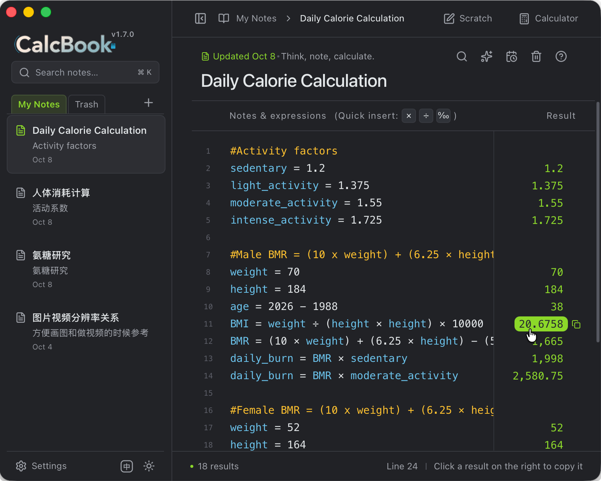

# Calcbook

中文说明见 [README.zh.md](README.zh.md)。

Write your calculations into your notes.

Type an expression and the answer lights up on the right — like an idea getting a reply. Chinese variables, percentages, unit conversions and section totals are all part of its everyday language. Jot things down as they come; every line quietly saves as plain text you can take anywhere. And when you'd rather tap a calculator, a little floating window is always on call.



It runs on your own computer: no account, no network, no telemetry. The executable is around 5 MB — just open it and go.

## What it can do

Put what you wrote and what you computed on the same page. On the left, your text and expressions; on the right, line-by-line results in step. Change one number and every downstream answer updates — like a ledger that balances itself.

| Feature | In one line |
| --- | --- |
| Calculate as you write | Mix text and expressions; results line up as you go. Change a condition and answers recompute |
| Chinese variables | `交通`, `餐饮`, `预算` all work as variable names — bookkeeping that reads like sentences |
| Chinese-friendly | Fully bilingual UI (English / 中文); write Chinese units and the answer answers in Chinese — `(1米+25毫米)×100元/米` gives `102.5元` |
| Unit conversion & mixing | Both Chinese and English units: `5 km to m`, `90 min to hour`; `1英里 + 1公里` mixes directly and lands in metric (`2.6093公里`) |
| Metric / Imperial / Market | Three unit systems mix freely; results lean metric and toward finer units (`1 mile + 1 ft` → `5,281 foot`); pin a target system in settings |
| Section totals | Blank lines split sections; type `sum` or `average` and the total appears |
| A calculator on call | Independent floating window: single instance, minimizable, expression & history kept; "insert into note" sends it back to your text |
| One-click formatting | Spaces, thousands separators, unit style and unit system all customizable; tidy messy expressions into a clean ledger in one click |
| High-precision decimals | `0.1 + 0.2` is exactly `0.3`; 64 significant decimal digits — no floating-point surprises with money |
| Edit history | Automatic snapshots while you edit: up to every 10 minutes in the last hour, hourly archives beyond that; preview and restore from a dialog |
| Plain text, take it anywhere | Every note is a `.txt` any editor can open; drop outside `txt` files into the folder and they're picked up as notes |
| Trash | Deleted notes go to the Trash first, restorable anytime; files are deleted only after confirmation |
| Two themes | Paper white and midnight, one click in the corner |

## When it's handy

- **Everyday bookkeeping**: what you spent today, over budget this month — type `sum` and the total just appears.
- **Shopping comparisons**: `unit price × quantity`, ten-percent-off percentages — compare and keep it in the note.
- **Before a trip**: kilometers to miles, minutes to hours, splitting a budget per person.
- **Kitchen & baking**: grams to pounds, milliliters to liters, converting while you calculate.
- **Study & homework**: check algebra, break down percentages, keep the work and the answer together.
- **Renovation & crafts**: material lengths, counts and unit prices — measure, note, total.
- **At the workbench**: small arithmetic for quotes, schedules and headcount — no spreadsheet needed.

In short: any "jot a few numbers and calculate" moment is a moment for Calcbook — no sheets, no calculator app switching.

## Quick syntax

```text
# Weekend budget
交通 = 186 × 2
住宿 = 420 × 2
餐饮 = 240
预算 = 交通 + 住宿 + 餐饮
每人 = 预算 / 2
备用金：每人 + 10%

5 km to m
90 min to hour
1英里 + 1公里

合计
```

- A leading `#` marks a section title, `//` a comment; `label: expression` computes only what follows the colon.
- `x` and `×` both multiply; `[]`, `{}`, `()` are interchangeable grouping brackets, nestable up to 3 levels.
- Results on the right are click-to-copy buttons; functions include `sqrt`, `abs`, `round`, `ceil`, `floor` and more.
- Full syntax (unit list, reserved words, totals rules) lives in the [calculation language contract](docs/product-specs/calculation-language.md); the in-app "?" in the toolbar has a cheat sheet.

## Keyboard shortcuts

| Keys | Action |
| --- | --- |
| `⌘/Ctrl N` | New note |
| `⌘/Ctrl K` | Search notes |
| `⌘/Ctrl F` | Find & replace (current note) |
| `⌘/Ctrl S` | Save now |
| `⌘/Ctrl ⇧ C` | Copy the current line's result |
| `⌘/Ctrl C` / `⌘/Ctrl X` | Copy / cut the whole line when nothing is selected |
| `⌘/Ctrl ,` | Open settings |

## Download & getting started

Grab the installer for your platform from [GitHub Releases](https://github.com/Tairraos/calcbook/releases) (macOS Apple Silicon / Intel, Windows, Linux). The macOS build is unsigned and un-notarized; if it's blocked on first open, right-click and choose "Open".

Prefer running from source:

```sh
pnpm install --frozen-lockfile
pnpm dev                 # browser preview, http://127.0.0.1:1420
pnpm desktop             # standalone Tauri desktop window
```

You need Node.js 22.18+ (24 LTS recommended), pnpm 10.25; for the desktop app also Rust stable (on macOS, Xcode Command Line Tools).

## Your data is yours

- Desktop notes live in `~/.calcbook/`: one `.txt` per note named after its title, and you can move storage to any folder you like (OneDrive and iCloud work fine) in settings.
- Notes are plain `.txt`: saving appends ` = result` to computed lines, importing strips and recomputes them. `.txt` files you drop in yourself are picked up as notes and are never deleted or rewritten by the app.
- The UI speaks English and Chinese — switch with the button next to the theme toggle; Chinese units always calculate, and the result follows your interface language.
- Search, export and edit history all happen locally; the app makes no network requests.

## Participating

Issues and PRs are welcome: fixing a typo, reporting a miscalculated example, or adding a missing unit are all great first steps. Before diving in, read [AGENTS.md](AGENTS.md) and the [docs index](docs/index.md) for project boundaries and how things are verified. Small steps, with reproducible examples.

## Development

```sh
pnpm check               # docs/architecture gate + lint + types + tests + production build
pnpm check:native        # Rust fmt + clippy + persistence tests
pnpm bench               # 300-line calculation performance budget
pnpm desktop:build       # unsigned .app on this machine
```

Architecture and product contracts: [ARCHITECTURE.md](ARCHITECTURE.md), [product scope](docs/product-specs/mvp.md) and [AGENTS.md](AGENTS.md).

## License

[MIT](LICENSE)
