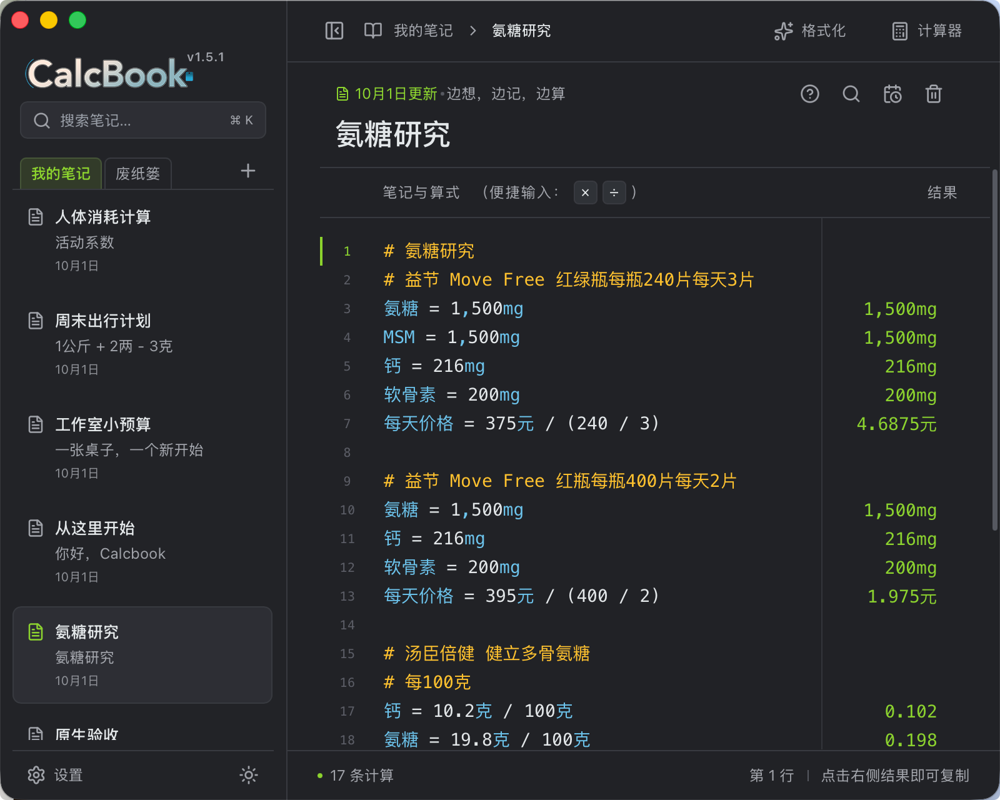

# Calcbook

把计算写进笔记。写下一行算式，答案就在右边亮起——像想法得到了回应。中文变量、百分比、单位换算、分段汇总都是它的日常语言；灵感来时随手一记，每一笔都悄悄存成纯文本，随时可以带走。想按计算器的时候，旁边还有一只随叫随到的小窗。

基于 **Tauri 2 + React + TypeScript** 构建，本地运行、离线可用。



当前是可运行的本地首版：中文变量、四则运算、百分比、单位换算、分段汇总、笔记管理、自动保存和文本导入导出。笔记以 Numi 兼容的 `.txt` 保存，可与 Numi 共用同一批文件。公制英制单位中英文都认识，混算时并入公制；设置里可选单位写法（自由/中文/英文）。普通计算器是独立浮动小窗：单实例、可最小化、关闭后重开恢复算式与历史（app 退出即清空）、失焦 5 分钟自动收起，「写入当前笔记」跨窗送达。侧栏底部以太阳/月亮图标在纸白与午夜两套配色间切换；关于信息包含版本、构建时间和 GitHub 链接。

## 启动

需要 Node.js 22.18+（推荐 24 LTS）、pnpm 10.25；桌面还需要 Rust stable 和系统编译工具。macOS 使用 Xcode Command Line Tools。

```sh
pnpm install --frozen-lockfile
pnpm dev                 # http://127.0.0.1:1420
pnpm desktop             # 独立 Tauri 桌面窗口
```

两个命令会使用相同端口，择一运行；启动时会先结束占用该端口的监听进程（不区分占用者），再启动服务。浏览器预览使用 localStorage，不能配置本机文件夹。桌面版默认保存到 `~/.calcbook/`：`workspace.json` 保存笔记列表与主题，每篇笔记的正文是目录下一个以标题命名的 `.txt`，例如 `人体消耗计算.txt`。通过左下角设置选择其他目录后，会复制当前笔记并将后续保存写入新目录，原文件保留。所选目录已有不同的笔记时会拒绝覆盖。

`.txt` 与 Numi 双向兼容：保存时在成功计算的行尾追加 ` = 结果`，导入时剥离并重新计算，因此文件可以直接用 Numi 打开、编辑，也可以在 Numi 里新建后导入 Calcbook。只清理上一份元数据里由本应用管理的文件，用户自己放进目录的 `.txt` 不会被删除。改造前的单文件工作区会在首次读取时自动迁移，旧文件保留为 `workspace.json.bak`。

存储位置配置保存在系统应用配置目录的 `settings.json`（macOS 为 `~/Library/Application Support/com.tairraos.calcbook/`）。首次升级会在默认目录尚无工作区时复制旧应用数据目录中的笔记；损坏数据不会被空笔记覆盖。

开发也使用上述默认位置。做回归时必须显式隔离配置和数据；两个路径都需为绝对路径，发行版不读取这些环境变量：

```sh
CALCBOOK_PORT=1430 \
CALCBOOK_CONFIG_DIR="$PWD/.calcbook-data/config" \
CALCBOOK_DATA_DIR="$PWD/.calcbook-data/workspace" \
pnpm desktop
```

```sh
pnpm check               # 文档/架构 + lint + 类型 + 测试 + 前端构建
pnpm check:native        # Rust fmt + clippy + 持久化测试
pnpm bench               # 300 行计算性能预算
pnpm desktop:build       # 本机生成未签名 .app（默认只打 app，不产 dmg）
```

构建产物在 `target/release/bundle/`（Cargo target 目录通过 `.cargo/config.toml` 统一到仓库根）。`target/release/` 作为增量编译缓存保留，手动清理前后续构建更快。当前以 macOS 为首个验证平台；Windows/Linux 打包、签名、公证、自动更新尚未接入。

## 写法

```text
# 周末预算
交通 = 186 × 2
住宿 = 420 × 2
餐饮 = 240
预算 = 交通 + 住宿 + 餐饮
每人 = 预算 / 2
备用金：每人 + 10%

{[18 + 24] x (3 - 1)}

5 km to m
90 min to hour
```

右侧结果可以点击复制。支持用 `x` 表示乘法，以及 `[]`、`{}`、`()` 分组。单位中英文都认识（`1英里 + 1公里` 得 `2.609344 km`，公制英制混算并入公制）；设置里可选单位写法：中文/英文模式会在光标离开刚算完的行时把该行单位改写过去。普通计算器的结果最多显示三位小数，十位整数以上使用科学计数法；字号随可用宽度缩小，续算保留内部精度。「写入当前笔记」插入原算式，后续仍可编辑重算。

`⌘/Ctrl N` 新建，`⌘/Ctrl K` 搜索，`⌘/Ctrl S` 保存，`⌘/Ctrl Shift C` 复制当前行结果，`⌘/Ctrl ,` 打开设置。计算器窗口的工具行图标可展开「最近计算」侧栏。

## 继续开发

从 [AGENTS.md](AGENTS.md) 进入项目地图，再按任务阅读相关契约：

- [文档索引](docs/index.md) / [产品范围](docs/product-specs/mvp.md)
- [架构](ARCHITECTURE.md) / [计算语言](docs/product-specs/calculation-language.md)
- [Harness 工作方式](docs/harness.md) / [质量与验证证据](docs/QUALITY_SCORE.md)
- [OpenAI 与 Numi 调研](docs/references/research.md) / [技术债务与后续路线](docs/exec-plans/tech-debt.md)

未完成的计算功能及验收条件记录在 [计算语言文档](docs/product-specs/calculation-language.md)，工程与发行缺口记录在 [技术债务](docs/exec-plans/tech-debt.md)。语法范围以仓库契约和测试为准。保留原仓库 [MIT License](LICENSE)。
